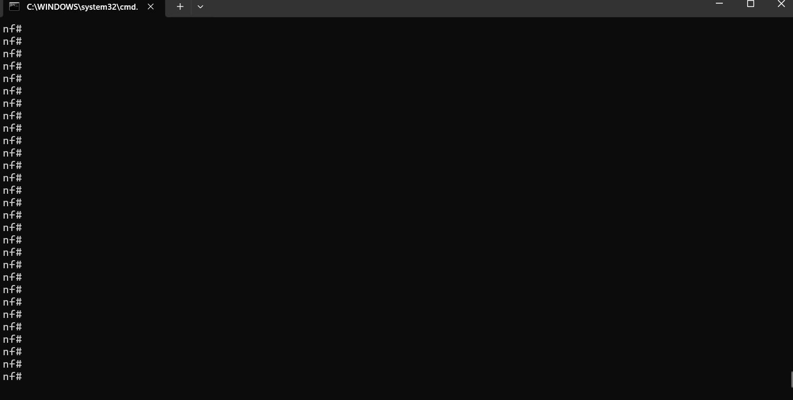
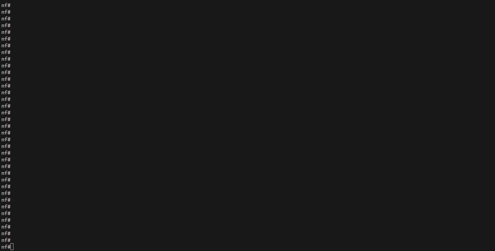
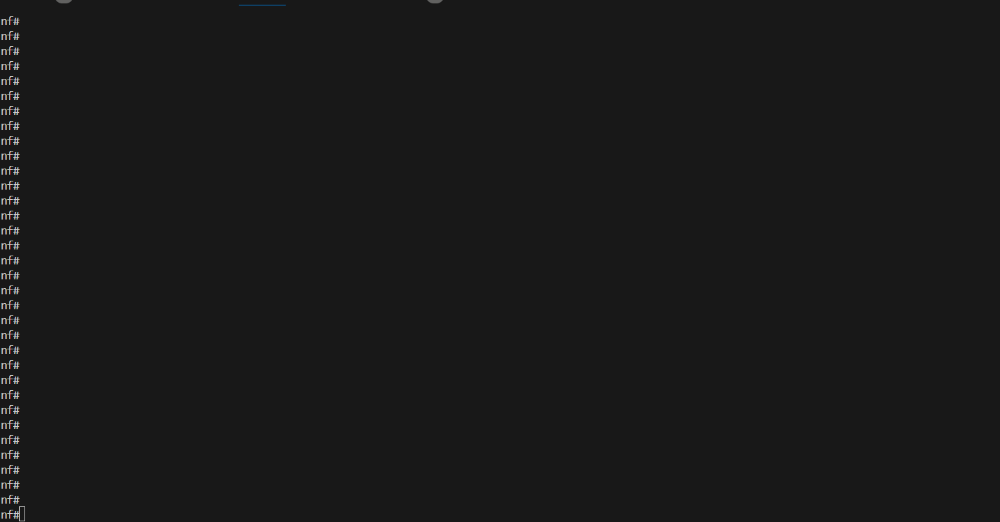

[![Downloads][pepy-downloads-badge]][pepy-downloads-link]
[![PyPI][pypi-latest-release-badge]][pypi-latest-release-link]
[![PyPI versions][pypi-pyversion-badge]][pypi-pyversion-link]
[![GitHub Discussion][github-discussions-badge]][github-discussions-link]
[![Code style: black][black-badge]][black-link]

# Network Automations Fabric - NORFAB

NORFAB is a tool for extreme network automations.

Interested? read [documentation](https://dmulyalin.github.io/NORFAB/)

# The IDEA

Most of the software to manage networks falls into one of the two categories: 

- heavyweight platforms running on dedicated infrastructure
- lightweight scripts or tools developed and run locally

NORFAB goal is to be both - software you can run equally well on your laptop or on a 
server, centralized or fully distributed, lightweight and feature reach. Capable of 
doing any use cases without the need to throw gazillions of dollars and man hours at 
it. Always ready to serve the purpose of unlocking engineers superpowers managing
modern network and making their life better.

# Key Features

- Run Anywhere - Windows, MAC, Linux, in a container or VM, on-prem or in cloud, centralized or distributed
- Extend Anything - extendability is in the core of NORFAB
- Integrate with Everything - Python API, REST API, CLI northbound interfaces
- Manage Anything - develop your own services or use built-in to manage your network infrastructure
- Model and data driven - Pydantic models for API, validation and documentation
- Automate Anything - we mean it, sky is the limit on what you can do with NORFAB automating your networks

# Architecture

**TLDR** Service-Oriented Architecture (SOA)

Clients communicate with broker to run the jobs, broker distributes jobs across workers comprising the service.

# History

NORFAB is a successor of Salt-Nornir SaltStack proxy minion aiming 
to surpass its limitations.

# Use Cases (Eye Catching ASCII Cinema Staff)

**Collect show commands**

**Configure network devices**

**Test your network**

**Diagram your network**

**And many more** [read documentation](https://dmulyalin.github.io/NORFAB/)

[github-discussions-link]:     https://github.com/dmulyalin/norfab/discussions
[github-discussions-badge]:    https://img.shields.io/static/v1?label=Discussions&message=Ask&color=blue&logo=github
[black-badge]:                 https://img.shields.io/badge/code%20style-black-000000.svg
[black-link]:                  https://github.com/psf/black
[pypi-pyversion-link]:         https://pypi.python.org/pypi/norfab/
[pypi-pyversion-badge]:        https://img.shields.io/pypi/pyversions/norfab.svg
[pepy-downloads-link]:         https://pepy.tech/project/norfab
[pepy-downloads-badge]:        https://pepy.tech/badge/norfab
[pypi-latest-release-badge]:   https://img.shields.io/pypi/v/norfab.svg
[pypi-latest-release-link]:    https://pypi.python.org/pypi/norfab