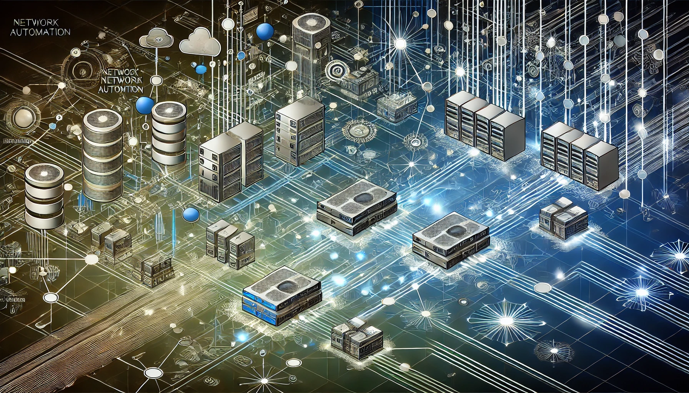
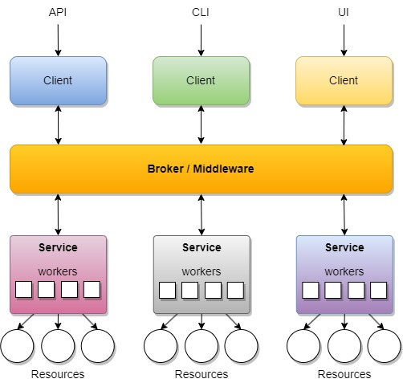

> **Through lifting others we rise** :rocket:

---

## Network Automations Fabric

Hi :smile:, thank you for getting here.

## Why - The Story :book:

In a world devoid of network automations, the streets were silent 
and grey. Without network automations, network engineers' lives 
became a grueling cycle of manual configurations and endless 
troubleshooting. They spent hours accessing each and every device, 
manually configuring and patching systems. Nights were sleepless, 
filled with frantic calls to resolve outages that could no longer 
be preemptively detected or resolved. Overwhelmed and exhausted, 
their innovative spirit was stifled by the sheer volume of 
repetitive tasks...

Let us introduce you to the world of Network Automations Fabric.

## What - The Idea :bulb:

NorFab is a task execution framework focused on network automations.

NorFab purpose is to augment network engineers capabilities with 
automation superpowers i.e. Iron Man Suite.

Most of the solutions to manage networks falls into one of the two 
categories: 

- heavyweight platforms running on dedicated infrastructure
- lightweight scripts or tools developed and run locally

NorFab can be both - software you can run equally well from
your laptop or on a server, centralized or fully distributed, 
lightweight and feature reach. Capable of doing any use cases 
without the need to throw unreasonable amounts of dollars and 
man hours at it. Always ready to serve the purpose of unlocking 
engineers superpowers managing modern networks and making 
engineers life better.

## How - The Vision :gear:

- **Run Anywhere** - locally on Windows, MAC or Linux, in a container, on a VM, in the cloud, centralized or distributed
- **Extend Anything** - extendability is in the core of NorFab
- **Integrate with Everything** - Python API, REST API, CLI northbound interfaces
- **Manage Anything** - develop your own services or use built-in to manage your network infrastructure
- **Model and data driven** - Pydantic models for API, validation and documentation
- **Automate Anything** - we mean it, sky is the limit on what you can do with NorFab automating your networks

## Architecture 

Key actors of the system include

- **CLIENTS** - consume services, processes that run on client machine and connect to broker
- **BROKER** - provides access to services for clients
- **SERVICES** - a collection of workers and resources they manage
- **WORKERS** - form services, processes that run anywhere and act as resource proxy agents
- **RESOURCES** - entities managed by workers, e.g. network devices, databases, file systems

Clients communicate with broker to submit jobs, broker distributes 
jobs across workers comprising the service, workers run jobs producing 
results retrieved by clients. In other words, *Services* 
hosted by *Workers* and expose functionality consumed by *Clients* 
via *Broker*.

