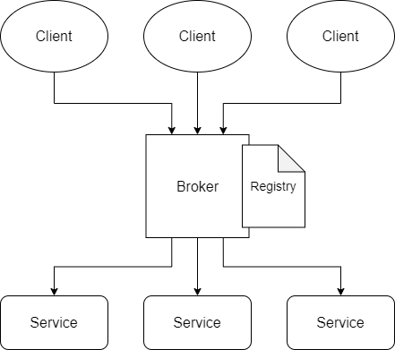
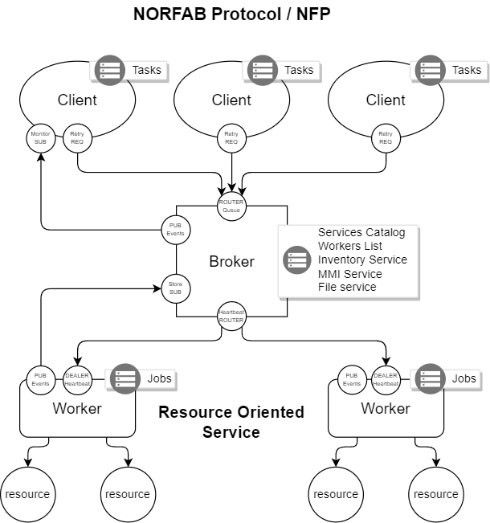
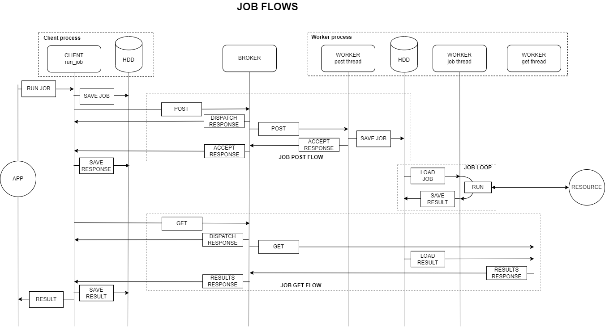

## High Level Design

---

## Low Level Design

---

Low level design revolves around resource oriented services - services
that manage resources, where resources could be databases, network devices,
file system etc.

## Jobs Execution Flow

---

There are multiple job flows implemented:

- **JOB POST FLOW** - for clients to publish jobs to workers
- **JOB LOOP** - job execution performed by workers
- **JOB GET FLOW** - for clients to retrieve job execution results

Above flows depicted on the diagram.

