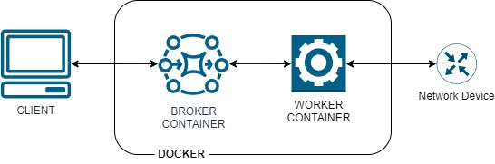

---
tags:
  - norfab
---

NorFab comes with a set of docker files to get NorFab up and running on docker.



Broker and workers deployed in docker environment, while clients can run on Windows, Linux or MAC machine connecting to the broker instance.

Prerequisites:

1. Docker setup is independent from this guide and assumption is that docker is installed and running 
2. Docker compose utility is available on the host
3. GIT also need to be installed on the system

Assumptions:

1. Docker host IP address is 192.168.1.130 and it is accessible by clients on TCP port 5555, docker host iP address of course will chane in your setup, adjust clinets' `inventory.yaml` file accordingly.

## Broker and Workers Containers Deployment

First, need to clone NorFab repository to the local folder on the docker host:

```
cd ~/
git clone https://github.com/dmulyalin/NORFAB.git norfab
```

To build NorFab docker images we are going to use `docker compose` utility, it will create broker and nornir service workers containers:

```
cd norfab/docker
docker compose build
```

Once build finished we can start the containers:

```
docker compose start
```

After broker reports that it is started and worker shows that it is registered with broker, this is a good indication that things are going ok:

```
root@dockervm:/home/user/norfab/docker# docker compose up
[+] Running 2/0
 ✔ Container norfab-broker          Created                   0.0s 
 ✔ Container norfab-service-nornir  Created                   0.0s 
Attaching to norfab-broker, norfab-service-nornir
norfab-broker          | 2025-02-02 10:40:20.453 INFO [norfab.core.nfapi:210 ] -- Started broker, broker listening for connections on 'tcp://10.0.0.100:5555'
norfab-service-nornir  | 2025-02-02 10:40:21.528 INFO [norfab.core.worker:557 ] -- nornir-worker-1 - registered to broker at 'tcp://10.0.0.100:5555', service 'nornir'
norfab-broker          | 2025-02-02 10:40:21.530 INFO [norfab.core.broker:317 ] -- NFPBroker - registered new worker nornir-worker-1
norfab-service-nornir  | 2025-02-02 10:40:21.554 INFO [nornir_salt.plugins.inventory.DictInventory:138 ] -- nornir-salt.DictInventory inventory data validated
norfab-service-nornir  | 2025-02-02 10:40:21.566 INFO [norfab.workers.nornir_worker:246 ] -- nornir-worker-1 - Started
...
```

Folder `norfab/docker/norfab` mounter to the containers as a volume under `/etc/norfab` path and this is the content of `inventory.yaml` file:

``` inventory.yaml
# broker settings
broker:
  endpoint: "tcp://10.0.0.100:5555"
  
# workers inventory section
workers:
  nornir-*:
    - nornir/common.yaml  
  nornir-worker-1:
    - nornir/nornir-worker-1.yaml
    
# list what entities we want to start on this node
topology:
  broker: True
  workers:
    - nornir-worker-1
```

Docker compose starts a broker process on `norfab-broker` container under `10.0.0.100` IP address and a single Nornir Service worker process named `nornir-worker-1` on a `norfab-service-nornir` container. 

File `inventory.yaml` can be adjusted to configure additional Nornir service workers to make `norfab-service-nornir` container run as many Nornir Service worker processes as we need.

Before we proceed with setting up the client, need to grab encryption public key value from the broker:

```
docker exec -it norfab-broker bash
cd /etc/norfab/
nfcli --show-broker-shared-key
```

Running above commands will produce similar to this output:

```
root@user:/home/user/norfab/docker# docker exec -it norfab-broker bash
root@norfab-broker:/# cd /etc/norfab
root@norfab-broker:/etc/norfab# nfcli --show-broker-shared-key
NorFab broker public key content:

'''
#   ****  Generated on 2025-02-02 09:31:04.387927 by pyzmq  ****
#   ZeroMQ CURVE Public Certificate
#   Exchange securely, or use a secure mechanism to verify the contents
#   of this file after exchange. Store public certificates in your home
#   directory, in the .curve subdirectory.

metadata
curve
    public-key = "j{5-J9<Qs:!@CVFsO$)UH>mf%mP<05[#%bBf(ofo"

'''

Key file location: '__norfab__/files/broker/public_keys/broker.key'

Copy above key into NorFab clients and workers 'public_keys/broker.key' file or 
put public-key value into clients and workers inventory.yaml 'broker' section 
under 'shared_key' parameter:

broker:
  shared_key: "j{5-J9<Qs:!@CVFsO$)UH>mf%mP<05[#%bBf(ofo"

root@norfab-broker:/etc/norfab# 
```

Public key value NorFab clients will need in this case is `"j{5-J9<Qs:!@CVFsO$)UH>mf%mP<05[#%bBf(ofo"`

## Client Setup

After broker and worker containers are running need to setup a NorFab client, client can run on any machine that can connect to the docker host on its IP address on TCP port 5555.

Firs, lets install norfab on the client machine:

```
pip install norfab[nfcli]
```

Second, need to create a folder to host NorFab files:

```
nfcli --create-env norfab-env
cd norfab-env
```

Next need to configure broker encryption key in the `norfab-env/inventory.yaml` under `broker` section and all the other content can be deleted:

``` inventory.yaml
# broker settings
broker:
  endpoint: "tcp://10.0.0.100:5555"
  shared_key: "j{5-J9<Qs:!@CVFsO$)UH>mf%mP<05[#%bBf(ofo"
```

Folder `norfab-env/nornir` also can be deleted. Client only need `inventory.yaml` file with broker endpoint and broker shared key details to successfully connect with the broker.

Last, run `nfcli` client from withing `norfab-env` folder:

```
nfcli -c
```


