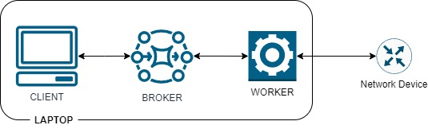

---
tags:
  - norfab
---

The simplest way to start with NorFab is to do local deployment when broker, workers and client processes all run locally, this is what we going to demonstrate in this guide.



Client, broker and worker all should be able to run on same machine Windows, Linux or MAC.

Once NorFab installed, next step is to create a folder that will hold your environment. Run this command to create NorFab folders and files:

```
nfcli --create-env norfab
```

This will create ``norfab`` folder and inside of it will create ``inventory.yaml``, file name is important as NORFAB by default searches for ``inventory.yaml``, file content is:

``` yaml title="inventory.yaml"
broker: # (1)!
  endpoint: "tcp://127.0.0.1:5555" # (2)!

workers: # (3)!
  nornir-*: # (4)!
    - nornir/common.yaml   
  nornir-worker-1: # (5)!
    - nornir/nornir-worker-1.yaml

topology: # (6)!
  broker: True # (7)!
  workers: # (8)!
    - nornir-worker-1
```

1.  Broker configuration inventory section
2.  URL to listen for connections on - ``localhost`` port ``5555`` in this case
3.  Workers configuration inventory section
4.  [glob pattern](https://docs.python.org/3/library/fnmatch.html) that will match all workers with ``nornir-`` in the name and map ``common.yaml`` file content for each of them
5.  Worker definition to map inventory file to a specific worker that has name ``nornir-worker-1``
6.  Topology section to define what components to run
7.  Start broker process
8.  List of workers names to start processes for

Command `--create-env` assumes we are working with Nornir service and creates ``nornir`` folder and inside of it creates two files. First file ``common.yaml`` to host configuration common for all Nornir service workers:

``` yaml title="common.yaml"
service: nornir # (1)!
broker_endpoint: "tcp://127.0.0.1:5555" # (2)!

# Nornir inventory and configuration
runner: # (3)!
  plugin: RetryRunner
hosts: {}
default: {} # (4)!
groups: {} # (5)!
```

1.  Name of the service this worker hosting
2.  Broker URL to initiate connections with
3.  Nornir runner plugin configuration
4.  Nornir ``default`` data section
5.  Nornir groups definition section

Second file specific to the worker with name ``nornir-worker-1`` which holds Nornir inventory data:

``` yaml title="nornir-worker-1.yaml"
hosts:
  ios-device-1:
    hostname: 192.168.1.1
    platform: cisco_ios
    username: admin
    password: admin
```

This is how files structure will look like:

``` yaml
└───norfab
    │   inventory.yaml
    │
    └───nornir
            common.yaml
            nornir-worker-1.yaml
```

Now you are ready to start NorFab Interactive Command Line Shell Client. Open terminal window, navigate to the folder where ``inventory.yaml`` located and start NFCLI:

```
C:\>cd norfab
C:\norfab>nfcli
nf#
```

this will start the NorFab broker process, Nornir worker process, instantiate
NFCLI client and drop you into interactive command line shell :shell:

``` yaml
nf#? # (1)!
 file      File sharing service
 netbox    Netbox service
 nornir    Nornir service
 show      NorFab show commands
 exit      Exit current shell
 help      Print help message
 pwd       Print current shell path
 top       Exit to top shell
nf#show workers # (2)!
 name             service  status  holdtime  keepalives tx/rx  alive (s)
 nornir-worker-1  nornir   alive   12.8      58 / 58           149
nf#
nf#nornir # (3)!
nf[nornir]#?
 cfg     Configure devices over CLI interface
 cli     Send CLI commands to devices
 show    Show Nornir service parameters
 task    Run Nornir task
 test    Run network tests
 end     Exit application
 exit    Exit current shell
 help    Print help message
 pwd     Print current shell path
 top     Exit to top shell
nf[nornir]#show hosts table details
+-----------------+--------------+------------+-------------+--------+----------+------------+
| worker          | host         | platform   | hostname    | port   | groups   | username   |
+=================+==============+============+=============+========+==========+============+
| nornir-worker-1 | ios-device-1 | cisco_ios  | 192.168.1.1 | None   | []       | admin      |
+-----------------+--------------+------------+-------------+--------+----------+------------+
nf[nornir]# end
Exiting...
```

1. Question mark plus enter to print commands help
2. Run show command
3. Drop into Nornir Service command shell

NorFab CLI supports Tab completions, question mark help together with sub-shells, read more about NorFab CLI and how to use it [here](clients_nfcli_overview.md).

:star: That's it :star:
