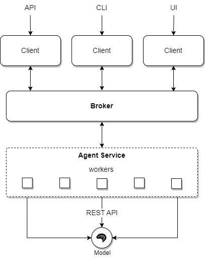

---
tags:
  - agent
---

# Agent Service

The Agent Service is a key component of the Network Automations Fabric (NORFAB) that leverages AI-based agents to enhance network automation and management.



# Using Ollama

[Ollama](https://ollama.com/) is an application designed to facilitate the use of large language models (LLMs) on your local machine. It provides a user-friendly interface and REST API for interacting with these models, enabling various AI-driven tasks such as natural language processing, text generation, and more. By running Ollama on your PC, you can leverage the power of LLMs for a wide range of applications, including network automation, data analysis, and intelligent agent services.

In the context of the NorFab Agent Service, Ollama acts as a bridge between the AI agents and the LLMs, allowing the agents to connect to and utilize the capabilities of the models specified in the inventory. This integration enhances the functionality of the Agent Service, enabling more advanced and intelligent automation tasks.

Follow official Guide on how to run Ollama Models - [GitHub link](https://github.com/ollama/ollama)

Once Ollama application installed, configure [NorFab Agent Worker inventory](./services_agent_service_inventory.md) and proceed with running it by updating NorFab `inventory.yaml` file:

``` yaml title="inventory.yaml"
broker:
  endpoint: "tcp://127.0.0.1:5555"

workers:
  agent-worker-1:
    - agents/agent-worker-1.yaml

topology:
  broker: True
  workers:
    - agent-worker-1
```

Where `agent-worker-1.yaml` content is:

```
service: agent
broker_endpoint: "tcp://127.0.0.1:5555"
llm_flavour: ollama
llm_model: lama3.1:8b
llm_temperature: 0.5
llm_base_url: "http://127.0.0.1:11434"
```