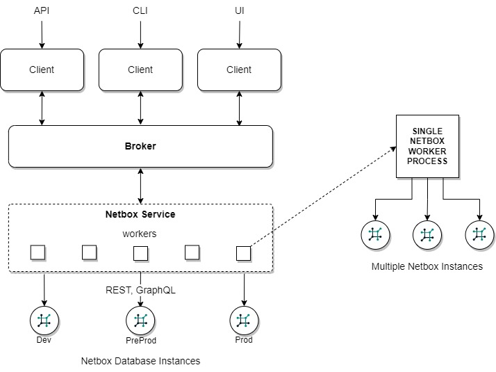

---
tags:
  - Netbox
---

# Netbox Service

The Netbox Service allows NorFab to integrate with [Netbox](https://github.com/netbox-community/netbox) - a well-adopted open-source tool for documenting networks. This integration provides network engineers and administrators with powerful capabilities to manage and automate their network infrastructure using the rich data stored in Netbox.

## Overview

Netbox is a comprehensive network documentation and management tool that includes features for IP address management (IPAM), data center infrastructure management (DCIM), and more. By integrating Netbox with NorFab, you can leverage the detailed network data stored in Netbox to automate various network tasks, ensuring consistency and accuracy across your network operations.

## NorFab Netbox Service Key Features

### Multi-Instance Support

With each NorFab Netbox worker capable of working with multiple Netbox instances, NorFab Netbox Service offers high flexibility. This allows you to manage and automate tasks across different Netbox instances, making it ideal for large-scale environments with multiple data centers or network segments.

### Device and Interface Management

The Netbox Service enables you to retrieve and manage detailed information about network devices and interfaces. This includes device configuration contexts, interface statuses, IP addresses, and more. By using this data you can  ensure that your network state is always up-to-date and accurate.

### GraphQL and REST API Integration

The Netbox Service leverages both REST and GraphQL API provided by Netbox to perform complex queries and retrieve specific data sets. This allows for efficient data retrieval and manipulation, enabling you to automate tasks such as inventory updates, configuration audits, and compliance checks.

### Customizable Filters and Queries

You can define custom filters and queries to retrieve specific data from Netbox. This flexibility allows you to tailor the data retrieval process to meet your specific needs, ensuring that you get the exact information required for your automation tasks.

### Caching and Performance Optimization

The Netbox Service includes caching mechanisms to optimize performance and reduce the load on your Netbox instances. By caching frequently accessed data, you can improve the efficiency of your automation workflows and ensure faster response times.

## Use Cases

### Automated Inventory Management

By integrating Netbox with NorFab, you can automate the process of updating and maintaining your network inventory. This ensures that your inventory data is always accurate and up-to-date, reducing the risk of configuration errors and improving overall network reliability.

### Configuration, Compliance and Auditing

The Netbox Service allows you to automate configuration compliance checks and audits through integration with other services such as Nornir. By retrieving inventory data from Netbox and comparing it against network state, you can quickly identify and remediate any deviations, ensuring that your network remains compliant.

## Getting Started

To get started with the Netbox Service, you need to configure your Netbox instances and define the necessary connection parameters in your NorFab inventory. Refer to the [Netbox Inventory](services_netbox_service_inventory.md) section for detailed instructions on setting up your inventory and integrating Netbox with NorFab.

## Conclusion

The Netbox Service is a powerful addition to NorFab, providing seamless integration with Netbox and enabling advanced network automation capabilities. By leveraging the rich data stored in Netbox, you can enhance your network management processes, improve accuracy, and ensure consistency across your network operations.
