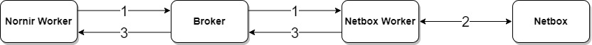

---
tags:
  - netbox
---

# Netbox Get Nornir Inventory Task

> task api name: `get_nornir_inventory`

This task designed to provide Nornir workers with inventory data sourced from Netbox.

**How it works**

Netbox NorFab workers able to talk with Netbox GraphQL and REST API. Nornir workers can be configured to request Nornir inventory from Netbox workers on startup. Netbox workers in response to such a request will be fetching devices data from Netbox and constructing Nornir inventory returning it to Nornir worker.

1. On startup Nornir worker sends `get_nornir_inventory` request to Netbox NorFab Workers

2. Netbox worker fetches devices data from netbox - hostnames, interfaces, ip addresses, circuits, connections, configuration contexts etc.

3. Netbox worker constructs Nornir inventory and sends it back to Nornir worker

## Get Nornir Inventory Sample Usage

## NORFAB Netbox Get Nornir Inventory Command Shell Reference

NorFab shell supports these command options for Netbox `get_nornir_inventory` task:

## Python API Reference

::: norfab.workers.netbox_worker.NetboxWorker.get_nornir_inventory