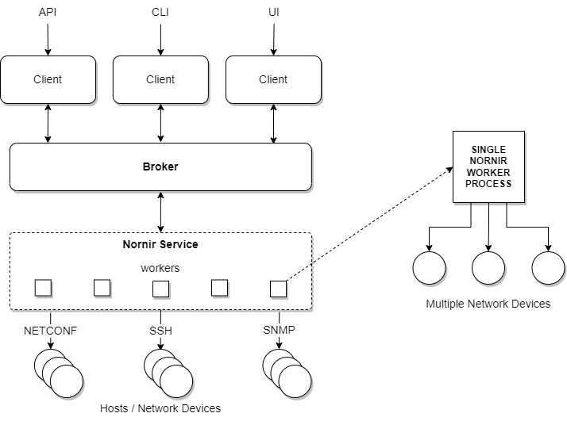

---
tags:
  - nornir
---

# Nornir Service

Nornir Service is based on [Nornir](https://github.com/nornir-automation/nornir)
library - a well adopted open-source tool for automating network devices operations.
 
 

With each Nornir worker capable of handling multiple devices simultaneously, 
Nornir Service offers high scalability, allowing efficient management of 
large device fleets. By optimizing compute resources such as CPU, RAM, and 
storage, it delivers cost-effective performance.

Additionally, Nornir Service supports various interfaces and libraries for 
seamless integration. For instance, the `cli` task can interact with devices 
via the SSH Command Line Interface (CLI) using popular libraries like Netmiko, 
Scrapli or NAPALM, providing flexibility for diverse network environments.

## Nornir Service Tasks

Nornir Service supports a number of tasks to interact with network devices using 
some of the most popular open source libraries such as Netmiko, NAPALM, Scrapli, 
Ncclient, Scrapli NETCONF, pygnmi, puresnmp, TextFSM, TTP etc.

| Task          | Description  | Use Cases |
|---------------|--------------|-----------|
| **[task](services_nornir_service_tasks_task.md)** | Run Nornir custom tasks | Pure Python per device workflows, do anything you want, it is pure python |
| **[cli](services_nornir_service_tasks_cli.md)** | Executes CLI commands on network devices using libraries like Netmiko, Scrapli or NAPALM. | Device diagnostics, retrieving device information. |
| **[cfg](services_nornir_service_tasks_cfg.md)** | Manages device configurations, including pushing configurations. | Automated configuration management. |
| **[test](services_nornir_service_tasks_test.md)** | Run test suites against network devices. | Network testing, troubleshooting, device compliance, configuration verification. |
| **[network](services_nornir_service_tasks_network.md)** | A collection of network utilities such as ping and DNS. | Check device connectivity, verify and resolve DNS records. |
| **[parse](services_nornir_service_tasks_parse.md)** | Parses command outputs using TextFSM, NAPALM getters or TTP to extract structured data. | Data extraction from CLI outputs, automated report generation, configuration validation. |
| **[diagram](services_nornir_service_tasks_diagram.md)** | Produce Network L2,  L3, OSPF or ISIS routing diagrams in DrawIO or yED formats. | Automated network documentation, network validation. |
| **[file_copy](services_nornir_service_tasks_file_copy.md)** | COpy files to network devices over SCP. | Device software upgrades, certificates or license renewal. |