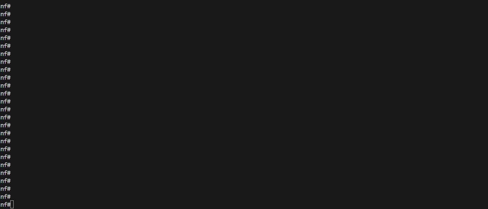

---
tags:
  - nornir
---

# Nornir Service CFG Task

> task api name: `cfg`

Nornir service `cfg` task designed to send configuration to devices using SSH and Telnet. Nornir `cfg` can use Netmiko, Scrapli and NAPALM libraries to configure devices.

## Nornir CFG Sample Usage

Example of sending configuration commands to devices.

!!! example

    === "CLI"
    
        ```
		C:\nf>nfcli
		Welcome to NorFab Interactive Shell.
		nf#

        ```
        
        Demo
		
		
    
		Above sends configuration commands to all Nornir hosts that contain `spine` or `leaf` in their hostname as we use `FC` - "Filter Contains" Nornir hosts targeting filter.
		
		`inventory.yaml` should be located in same folder where we start nfcli, unless `nfcli -i path_to_inventory.yaml` flag used. Refer to [Getting Started](../../norfab_getting_started.md) section on how to construct  `inventory.yaml` file
		
    === "Python"
    
		This code is complete and can run as is
		
        ```
        import pprint
        
        from norfab.core.nfapi import NorFab
        
        if __name__ == '__main__':
            nf = NorFab(inventory="inventory.yaml")
            nf.start()
            
            client = nf.make_client()
            
            res = client.run_job(
                service="nornir",
                task="cfg",
                kwargs={
                    "config": ["ntp server 10.0.0.1", "ntp server 10.0.0.2"],
                    "FC": "spine,leaf"              
                }
            )
            
            pprint.pprint(res)
            
            nf.destroy()
        ```
		 	
		Refer to [Getting Started](../../norfab_getting_started.md) section on how to construct  `inventory.yaml` file.
	
## Use Different Configuration Plugins

NorFab supports various configuration plugins such as `netmiko`, `napalm` and `scrapli`. These plugins enable you to push configurations to a wide range of network devices. Each plugin has its own set of capabilities and requirements, so it is essential to ensure that your Nornir inventory is properly configured for the chosen plugin. This includes specifying the necessary connection parameters and device-specific settings. By leveraging these plugins, you can standardize and automate the configuration management process across different network environments.

## Using Dry Run

The dry run feature in NorFab allows you to simulate the application of configurations without actually pushing them to the devices. This is particularly useful for testing and validation purposes, as it enables you to verify the correctness of your configurations before making any changes to the network. Additionally, the dry run feature can be used for generating and rendering device configurations, which is beneficial for staging environments where you need to prepare configurations in advance. By using dry run, you can ensure that your configurations are accurate and ready for deployment.

## Using Commit Confirmed

The commit confirmed feature provides an added layer of safety when pushing configurations to network devices. With this feature, you can apply a configuration with a rollback timer. If the configuration is not explicitly confirmed within the specified time, it will be automatically rolled back to the previous state. This is particularly useful in scenarios where you need to ensure that a configuration change does not negatively impact the network. By using commit confirmed, you can mitigate the risk of configuration errors and ensure network stability.

## Sourcing Configuration From Files

NorFab allows you to source configurations from text files stored on the broker. This approach enables you to manage configurations as files, making it easier to version control and maintain them. By storing configurations in files, you can apply them as needed, ensuring consistency and repeatability in your configuration management process. This method is particularly useful for large-scale deployments where configurations need to be applied to multiple devices in a controlled and organized manner.

## Using Jinja2 Templates

Jinja2 templates provide a powerful way to create dynamic configurations based on variables defined in your inventory or passed as job data. By using templates, you can generate configurations that are tailored to the specific requirements of each device. This approach allows you to automate the creation of complex configurations and ensures consistency across your network. Jinja2 templates are highly flexible and can be used to incorporate conditional logic, loops, and other advanced features, making them an essential tool for network automation.

## Templating Configuration with Inline Job Data

## Parsing and Generating Configuration in Templates

NorFab supports parsing of device output and the generation of new configurations within same template using parsing results. This capability allows you to create configurations based on the current state of the device, ensuring that your changes are applied accurately and efficiently. By parsing existing configurations, you can extract relevant information and use it to generate new configurations that are consistent with the device's current setup. 

## Outputting Text Tables

The NorFab interactive shell supports the table command, which can be used to format output into text tables. This feature relies on the tabulate module and supports most of its functionalities. By outputting results in table format, you can easily visualize and analyze the data, making it easier to interpret and act upon. This is particularly useful for displaying configuration results in a structured, concise and readable manner.

## Formatting Output Results

You can format the output results using various options provided by the Nornir worker. The output of the commands can be formatted using the `to_dict` parameter. When set to `True`, the results will be returned as a dictionary. When set to `False`, the results will be returned as a list. In addition `add_details` argument can be used to control the verbosity of the output and return additional Nornir result information such as:

- `changed` flag
- `diff` content if supported by plugin
- `failed` status
- `exception` details if task execution failed with error
- `connection_retry` counter to show how many times RetryRunner tried to establish a connection
- `task_retry` counter to show how many times RetryRunner tried to run this task

## Using Promptless Mode

NorFab supports a proprietary promptless mode that can be used with Netmiko. This mode is particularly useful when dealing with devices that do not have a consistent prompt or when the default Netmiko output collection functions are not reliable enough. By enabling promptless mode, you can ensure that configurations are applied accurately and efficiently, even in challenging environments. This feature enhances the robustness of your configuration management process and ensures that your network devices are configured correctly.
		
## NORFAB Nornir CFG Shell Reference

NorFab shell supports these command options for Nornir `cfg` task:

```
nf#man tree nornir.cfg
root
└── nornir:    Nornir service
    └── cfg:    Configure devices over CLI interface
        ├── timeout:    Job timeout
        ├── workers:    Filter worker to target, default 'all'
        ├── add_details:    Add task details to results, default 'False'
        ├── run_num_workers:    RetryRunner number of threads for tasks execution
        ├── run_num_connectors:    RetryRunner number of threads for device connections
        ├── run_connect_retry:    RetryRunner number of connection attempts
        ├── run_task_retry:    RetryRunner number of attempts to run task
        ├── run_reconnect_on_fail:    RetryRunner perform reconnect to host on task failure
        ├── run_connect_check:    RetryRunner test TCP connection before opening actual connection
        ├── run_connect_timeout:    RetryRunner timeout in seconds to wait for test TCP connection to establish
        ├── run_creds_retry:    RetryRunner list of connection credentials and parameters to retry
        ├── tf:    File group name to save task results to on worker file system
        ├── tf_skip_failed:    Save results to file for failed tasks
        ├── diff:    File group name to run the diff for
        ├── diff_last:    File version number to diff, default is 1 (last)
        ├── progress:    Display progress events, default 'True'
        ├── table:    Table format (brief, terse, extend) or parameters or True
        ├── headers:    Table headers
        ├── headers_exclude:    Table headers to exclude
        ├── sortby:    Table header column to sort by
        ├── reverse:    Table reverse the sort by order
        ├── FO:    Filter hosts using Filter Object
        ├── FB:    Filter hosts by name using Glob Patterns
        ├── FH:    Filter hosts by hostname
        ├── FC:    Filter hosts containment of pattern in name
        ├── FR:    Filter hosts by name using Regular Expressions
        ├── FG:    Filter hosts by group
        ├── FP:    Filter hosts by hostname using IP Prefix
        ├── FL:    Filter hosts by names list
        ├── FM:    Filter hosts by platform
        ├── FX:    Filter hosts excluding them by name
        ├── FN:    Negate the match
        ├── hosts:    Filter hosts to target
        ├── cfg_dry_run:    Dry run cfg function
        ├── *config:    List of configuration commands to send to devices
        ├── plugin:    Configuration plugin parameters
        │   ├── netmiko:    Use Netmiko plugin to configure devices
        │   │   ├── enable:    Attempt to enter enable-mode
        │   │   ├── exit_config_mode:    Determines whether or not to exit config mode after complete
        │   │   ├── strip_prompt:    Determines whether or not to strip the prompt
        │   │   ├── strip_command:    Determines whether or not to strip the command
        │   │   ├── read_timeout:    Absolute timer to send to read_channel_timing
        │   │   ├── config_mode_command:    The command to enter into config mode
        │   │   ├── enter_config_mode:    Do you enter config mode before sending config commands
        │   │   ├── error_pattern:    Regular expression pattern to detect config errors in the output
        │   │   ├── terminator:    Regular expression pattern to use as an alternate terminator
        │   │   ├── bypass_commands:    Regular expression pattern indicating configuration commands, cmd_verify is automatically disabled
        │   │   ├── commit:    Commit configuration, default 'True'
        │   │   ├── commit-confirm:    Perform commit confirm on supported platforms
        │   │   ├── commit-confirm-delay:    Confirmed commit rollback timeout in minutes, used with commit-confirm
        │   │   ├── commit-final-delay:    Time to wait in seconds before doing final commit, used with commit-confirm
        │   │   ├── commit-comment:    Commit operation comment
        │   │   └── batch:    Commands count to send in batches
        │   ├── scrapli:    Use Scrapli plugin to configure devices
        │   │   ├── dry_run:    Apply changes or not, also tests if possible to enter config mode
        │   │   ├── strip_prompt:    Strip prompt from returned output
        │   │   ├── failed_when_contains:    String or list of strings indicating failure if found in response
        │   │   ├── stop_on_failed:    Stop executing commands if command fails
        │   │   ├── privilege_level:    Name of configuration privilege level to acquire
        │   │   ├── eager:    Do not read until prompt is seen at each command sent to the channel
        │   │   └── timeout_ops:    Timeout ops value for this operation
        │   └── napalm:    Use NAPALM plugin to configure devices
        │       ├── replace:    Whether to replace or merge the configuration
        │       ├── dry_run:    Apply changes or not, also tests if possible to enter config mode
        │       └── revert_in:    Amount of time in seconds after which to revert the commit
        └── job_data:    Path to YAML file with job data
nf#
```

``*`` - mandatory/required command argument

## Python API Reference

::: norfab.workers.nornir_worker.NornirWorker.cfg