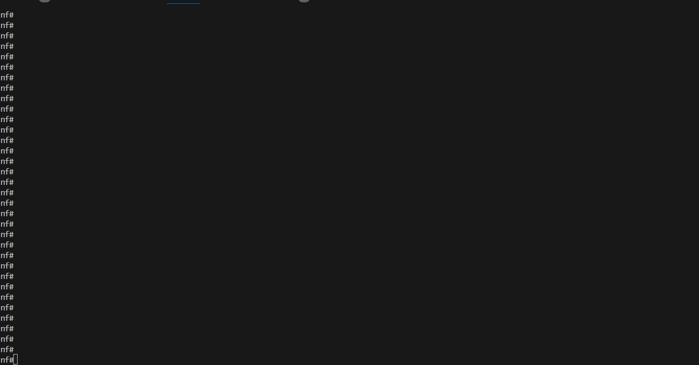

---
tags:
  - nornir
---

# Nornir Service Diagram Task

The Nornir Service Diagram Task is a powerful component of NorFab's Nornir service, designed to create detailed network diagrams. By leveraging the [N2G (Need to Graph)](https://github.com/dmulyalin/N2G/) module, this task enables network engineers and architects to visualize network topologies and configurations, facilitating better network management and planning.

## Creating Layer-2 Network Diagram

Layer-2 network diagrams illustrate the data link layer of the OSI model, showing how devices are interconnected within a local area network (LAN) based on the output provided by LLDP and CDP protocols. These diagrams are essential for understanding the physical and logical connections between switches, routers, and other network devices. By creating Layer-2 network diagrams, you can identify potential bottlenecks, optimize traffic flow, and ensure efficient network design. The Nornir Service Diagram Task uses the N2G module to automatically generate these diagrams, providing a clear and accurate representation of your Layer-2 topology.

## Creating Layer-3 Network Diagram

Layer-3 network diagrams depict the network layer of the OSI model, highlighting the routing and IP addressing within a network. These diagrams are crucial for understanding how data is routed between different subnets and networks. By creating Layer-3 network diagrams, you can visualize the routing paths, identify potential routing issues, and ensure proper IP address allocation. The Nornir Service Diagram Task leverages the N2G module to construct these diagrams, offering a comprehensive view of your Layer-3 network infrastructure.

!!! example

    === "CLI"
    
    ```
    nf#
    nf#
    nf#nornir
    nf[nornir]#diagram
    nf[nornir-diagram]#layer3 FC spine,leaf
    --------------------------------------------- Job Events -----------------------------------------------
    04-Jan-2025 22:59:56 85fd42146327446cae3c26ceb2077abf job started
    04-Jan-2025 22:59:56.664 nornir nornir-worker-1 ceos-spine-1, ceos-spine-2 task started - 'netmiko_send_commands'
    <omitted for brevity>
    04-Jan-2025 22:59:58 85fd42146327446cae3c26ceb2077abf job completed in 2.117 seconds

    --------------------------------------------- Job Results --------------------------------------------

    diagram: 'layer3', format: 'yed'
    saved at: './diagrams\layer3_2025-01-04_22-59-56.graphml'
    hosts: ceos-leaf-1, ceos-leaf-2, ceos-leaf-3, ceos-spine-1, ceos-spine-2
    nf[nornir-diagram]#
    ```

    Demo

    

    In this example:

    - `nornir` command switches to the Nornir sub-shell.
    - `diagram` command switches to the diagram task sub-shell.
    - `layer3` command run commands output collection for devices that have `spine` or `leaf` in their hostname as we use `FC` - "Filter Contains" Nornir hosts targeting filter, once output collected N2G parses commands output and constructs L3 Network diagram of subnets and IP addresses saving diagram in [yEd](https://www.yworks.com/products/yed) compatible format at `./diagrams\layer3_2025-01-04_22-59-56.graphml` file.
  

## Creating OSPF Routing Protocol Network Diagram

OSPF (Open Shortest Path First) is a widely used interior gateway protocol for routing within an autonomous system. Creating OSPF routing protocol network diagrams helps you visualize the OSPF areas, router adjacencies, and link metrics. These diagrams are useful for troubleshooting OSPF-related issues, optimizing OSPF configurations, and ensuring efficient routing. The Nornir Service Diagram Task utilizes the N2G module to generate OSPF network diagrams, providing a detailed view of your OSPF topology and configurations.

## Creating ISIS Routing Protocol Network Diagram

ISIS (Intermediate System to Intermediate System) is a popular interior gateway protocol used for routing within large networks. Creating ISIS routing protocol network diagrams allows you to visualize the ISIS areas, router adjacencies, and link metrics. These diagrams are vital for understanding the ISIS routing process, identifying potential issues and optimizing the network. The Nornir Service Diagram Task utilizes the N2G module to generate ISIS network diagrams, providing a detailed view of your ISIS topology and configurations.

## Creating draw.io Diagrams

N2G module can produce diagrams in several formats, to create [draw.io](https://www.drawio.com/) diagram need to use `format` argument with `drawio` value.

!!! example

    === "CLI"
    
    ```
    nf#
    nf#
    nf#nornir
    nf[nornir]#diagram
    nf[nornir-diagram]#format drawio layer3 FC spine,leaf
    --------------------------------------------- Job Events -----------------------------------------------
    04-Jan-2025 23:16:13 a2d39b5b1268488a95805baed96699a1 job started
    04-Jan-2025 23:16:14.277 nornir nornir-worker-1 ceos-spine-1, ceos-spine-2 task started - 'netmiko_send_commands'
    04-Jan-2025 23:16:14.289 nornir nornir-worker-2 ceos-leaf-1, ceos-leaf-2, ceos-leaf-3 task started - 'netmiko_send_commands'
    <omitted for brevity>
    04-Jan-2025 23:16:16 a2d39b5b1268488a95805baed96699a1 job completed in 2.606 seconds

    --------------------------------------------- Job Results --------------------------------------------

    diagram: 'layer3', format: 'drawio'
    saved at: './diagrams\layer3_2025-01-04_23-16-13.drawio'
    hosts: ceos-leaf-1, ceos-leaf-2, ceos-leaf-3, ceos-spine-1, ceos-spine-2
    nf[nornir-diagram]#

    ```

    - `nornir` command switches to the Nornir sub-shell.
    - `diagram` command switches to the diagram task sub-shell.
    - `format` argument specifies what diagram format to create, draw.io in this case.
    - `layer3` command run commands output collection for devices that have `spine` or `leaf` in their hostname as we use `FC` - "Filter Contains" Nornir hosts targeting filter, once output collected N2G parses commands output and constructs L3 Network diagram of subnets and IP addresses saving diagram in [draw.io](https://www.drawio.com/) compatible format at `./diagrams\layer3_2025-01-04_23-16-13.drawio` file.

## NORFAB Nornir Diagram Shell Reference

NorFab shell supports these command options for Nornir `diagram` task:

```
nf#man tree nornir.diagram
root
└── nornir:    Nornir service
    └── diagram:    Produce network diagrams
        ├── timeout:    Job timeout
        ├── workers:    Filter worker to target, default 'all'
        ├── format:    Diagram application format, default 'yed'
        ├── layer3:    Create L3 Network diagram using IP data
        │   ├── add_details:    Add task details to results
        │   ├── run_num_workers:    RetryRunner number of threads for tasks execution
        │   ├── run_num_connectors:    RetryRunner number of threads for device connections
        │   ├── run_connect_retry:    RetryRunner number of connection attempts
        │   ├── run_task_retry:    RetryRunner number of attempts to run task
        │   ├── run_reconnect_on_fail:    RetryRunner perform reconnect to host on task failure
        │   ├── run_connect_check:    RetryRunner test TCP connection before opening actual connection
        │   ├── run_connect_timeout:    RetryRunner timeout in seconds to wait for test TCP connection to establish
        │   ├── run_creds_retry:    RetryRunner list of connection credentials and parameters to retry
        │   ├── tf:    File group name to save task results to on worker file system
        │   ├── tf_skip_failed:    Save results to file for failed tasks
        │   ├── diff:    File group name to run the diff for
        │   ├── diff_last:    File version number to diff, default is 1 (last)
        │   ├── progress:    Display progress events, default 'True'
        │   ├── FO:    Filter hosts using Filter Object
        │   ├── FB:    Filter hosts by name using Glob Patterns
        │   ├── FH:    Filter hosts by hostname
        │   ├── FC:    Filter hosts containment of pattern in name
        │   ├── FR:    Filter hosts by name using Regular Expressions
        │   ├── FG:    Filter hosts by group
        │   ├── FP:    Filter hosts by hostname using IP Prefix
        │   ├── FL:    Filter hosts by names list
        │   ├── FM:    Filter hosts by platform
        │   ├── FX:    Filter hosts excluding them by name
        │   ├── FN:    Negate the match
        │   ├── hosts:    Filter hosts to target
        │   ├── group_links:    Group links between same nodes
        │   ├── add_arp:    Add IP nodes from ARP cache parsing results
        │   ├── label_interface:    Add interface name to the link’s source and target labels
        │   ├── label_vrf:    Add VRF name to the link’s source and target labels
        │   ├── collapse_ptp:    Combines links for /31 and /30 IPv4 and /127 IPv6 subnets into a single link
        │   ├── add_fhrp:    Add HSRP and VRRP IP addresses to the diagram
        │   ├── bottom_label_length:    Length of interface description to use for subnet labels, if 0, label not set
        │   └── lbl_next_to_subnet:    Put link port:vrf:ip label next to subnet node
        ├── layer2:    Create L2 Network diagram using CDP/LLDP data
        │   ├── add_details:    Add task details to results
        │   ├── run_num_workers:    RetryRunner number of threads for tasks execution
        │   ├── run_num_connectors:    RetryRunner number of threads for device connections
        │   ├── run_connect_retry:    RetryRunner number of connection attempts
        │   ├── run_task_retry:    RetryRunner number of attempts to run task
        │   ├── run_reconnect_on_fail:    RetryRunner perform reconnect to host on task failure
        │   ├── run_connect_check:    RetryRunner test TCP connection before opening actual connection
        │   ├── run_connect_timeout:    RetryRunner timeout in seconds to wait for test TCP connection to establish
        │   ├── run_creds_retry:    RetryRunner list of connection credentials and parameters to retry
        │   ├── tf:    File group name to save task results to on worker file system
        │   ├── tf_skip_failed:    Save results to file for failed tasks
        │   ├── diff:    File group name to run the diff for
        │   ├── diff_last:    File version number to diff, default is 1 (last)
        │   ├── progress:    Display progress events, default 'True'
        │   ├── FO:    Filter hosts using Filter Object
        │   ├── FB:    Filter hosts by name using Glob Patterns
        │   ├── FH:    Filter hosts by hostname
        │   ├── FC:    Filter hosts containment of pattern in name
        │   ├── FR:    Filter hosts by name using Regular Expressions
        │   ├── FG:    Filter hosts by group
        │   ├── FP:    Filter hosts by hostname using IP Prefix
        │   ├── FL:    Filter hosts by names list
        │   ├── FM:    Filter hosts by platform
        │   ├── FX:    Filter hosts excluding them by name
        │   ├── FN:    Negate the match
        │   ├── hosts:    Filter hosts to target
        │   ├── add_interfaces_data:    Add interfaces configuration and state data to links
        │   ├── group_links:    Group links between nodes
        │   ├── add_lag:    Add LAG/MLAG links to diagram
        │   ├── add_all_connected:    Add all nodes connected to devices based on interfaces state
        │   ├── combine_peers:    Combine CDP/LLDP peers behind same interface by adding L2 node
        │   └── skip_lag:    Skip CDP peers for LAG, some platforms send CDP/LLDP PDU from LAG ports
        ├── isis:    Create ISIS Network diagram using LSDB data
        │   ├── add_details:    Add task details to results
        │   ├── run_num_workers:    RetryRunner number of threads for tasks execution
        │   ├── run_num_connectors:    RetryRunner number of threads for device connections
        │   ├── run_connect_retry:    RetryRunner number of connection attempts
        │   ├── run_task_retry:    RetryRunner number of attempts to run task
        │   ├── run_reconnect_on_fail:    RetryRunner perform reconnect to host on task failure
        │   ├── run_connect_check:    RetryRunner test TCP connection before opening actual connection
        │   ├── run_connect_timeout:    RetryRunner timeout in seconds to wait for test TCP connection to establish
        │   ├── run_creds_retry:    RetryRunner list of connection credentials and parameters to retry
        │   ├── tf:    File group name to save task results to on worker file system
        │   ├── tf_skip_failed:    Save results to file for failed tasks
        │   ├── diff:    File group name to run the diff for
        │   ├── diff_last:    File version number to diff, default is 1 (last)
        │   ├── progress:    Display progress events, default 'True'
        │   ├── FO:    Filter hosts using Filter Object
        │   ├── FB:    Filter hosts by name using Glob Patterns
        │   ├── FH:    Filter hosts by hostname
        │   ├── FC:    Filter hosts containment of pattern in name
        │   ├── FR:    Filter hosts by name using Regular Expressions
        │   ├── FG:    Filter hosts by group
        │   ├── FP:    Filter hosts by hostname using IP Prefix
        │   ├── FL:    Filter hosts by names list
        │   ├── FM:    Filter hosts by platform
        │   ├── FX:    Filter hosts excluding them by name
        │   ├── FN:    Negate the match
        │   ├── hosts:    Filter hosts to target
        │   ├── ip_lookup_data:    IP Lookup dictionary or OS path to CSV file
        │   ├── add_connected:    Add connected subnets as nodes
        │   ├── ptp_filter:    List of glob patterns to filter point-to-point links based on link IP
        │   └── add_data:    Add data information to nodes and links
        ├── ospf:    Create OSPF Network diagram using LSDB data
        │   ├── add_details:    Add task details to results
        │   ├── run_num_workers:    RetryRunner number of threads for tasks execution
        │   ├── run_num_connectors:    RetryRunner number of threads for device connections
        │   ├── run_connect_retry:    RetryRunner number of connection attempts
        │   ├── run_task_retry:    RetryRunner number of attempts to run task
        │   ├── run_reconnect_on_fail:    RetryRunner perform reconnect to host on task failure
        │   ├── run_connect_check:    RetryRunner test TCP connection before opening actual connection
        │   ├── run_connect_timeout:    RetryRunner timeout in seconds to wait for test TCP connection to establish
        │   ├── run_creds_retry:    RetryRunner list of connection credentials and parameters to retry
        │   ├── tf:    File group name to save task results to on worker file system
        │   ├── tf_skip_failed:    Save results to file for failed tasks
        │   ├── diff:    File group name to run the diff for
        │   ├── diff_last:    File version number to diff, default is 1 (last)
        │   ├── FO:    Filter hosts using Filter Object
        │   ├── FB:    Filter hosts by name using Glob Patterns
        │   ├── FH:    Filter hosts by hostname
        │   ├── FC:    Filter hosts containment of pattern in name
        │   ├── FR:    Filter hosts by name using Regular Expressions
        │   ├── FG:    Filter hosts by group
        │   ├── FP:    Filter hosts by hostname using IP Prefix
        │   ├── FL:    Filter hosts by names list
        │   ├── FM:    Filter hosts by platform
        │   ├── FX:    Filter hosts excluding them by name
        │   ├── FN:    Negate the match
        │   ├── hosts:    Filter hosts to target
        │   ├── ip_lookup_data:    IP Lookup dictionary or OS path to CSV file
        │   ├── add_connected:    Add connected subnets as nodes
        │   ├── ptp_filter:    List of glob patterns to filter point-to-point links based on link IP
        │   └── add_data:    Add data information to nodes and links
        └── filename:    Name of the file to save diagram content
nf#
```

``*`` - mandatory/required command argument