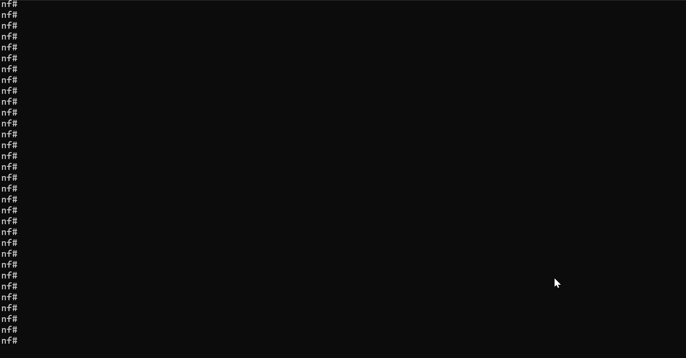

---
tags:
  - nornir
---

# Nornir Service "Task" Task

Nornir service `task` task can be used to run any arbitrary
Nornir task plugin function. Nornir task can be referenced
using OS path to custom task Python file or using dot notation
to reference import module.

Reference [Nornir Plugins](https://nornir.tech/nornir/plugins/) page
for a list of community built Nornir plugins.

## Nornir Tasks Sample Usage

Example of calling Nornir custom task function stored on NORFAB 
broker under `nornir_tasks/echo.py` file path:

```
├───inventory.yaml
└───nornir_tasks
    └───echo.py
```

Task `echo.py` takes provided arguments and echoes them back in
results:

``` echo.py
from nornir.core.task import Result, Task


def task(task: Task, **kwargs) -> Result:
    task.name = "echo"
    return Result(host=task.host, result=kwargs)
```

!!! example

    === "CLI"
    
        ```
		C:\nf>nfcli
		Welcome to NorFab Interactive Shell.
		nf#
		nf#nornir
		nf[nornir]#task
		nf[nornir-task]#plugin nf://nornir_tasks/echo.py arguments {"foo": "bar"} FC spine
		ceos-spine-1:
			echo:
				foo: bar
		ceos-spine-2:
			echo:
				foo: bar
		nf[nornir-task]#top
		nf#
        ```
        
        Demo
		
		
    
		Above runs `echo.py` custom Nornir task taking arguments `{"foo": "bar"}` 
		as an input and echoing them back. Task only executed for 
		Nornir hosts that contain `ceos-spine` in their hostname as 
		we use `FC` - "Filter Contains" Nornir hosts targeting 
		filter.
		
		`inventory.yaml` should be located in same folder where we 
		start nfcli, unless `nfcli -i path_to_inventory.yaml` flag 
		used. Refer to [Getting Started](norfab_getting_started.md) 
		section on how to construct  `inventory.yaml` file
		
    === "Python"
    
		This code is complete and can run as is
		
        ```
        import pprint
        
        from norfab.core.nfapi import NorFab
        
        if __name__ == '__main__':
            nf = NorFab(inventory="inventory.yaml")
            nf.start()
            
            client = nf.make_client()
            
            res = client.run_job(
                service="nornir",
                task="task",
                kwargs={
                    "plugin": "nf://nornir_tasks/echo.py",
					"argument": {"foo": "bar"},
                    "FC": "ceos-spine"    
                }
            )
            
            pprint.pprint(res)
            
            nf.destroy()
        ```

		Once executed, above code should produce this output:
		
		```
		C:\nf>python nornir_task_docs.py
		{'nornir-worker-1': {'errors': [],
							'failed': False,
							'messages': [],
							'result': {'ceos-spine-1': {'echo': {'argument': {'foo': 'bar'}}},
										'ceos-spine-2': {'echo': {'argument': {'foo': 'bar'}}}},
							'task': 'nornir-worker-1:task'}}
		```
		
		Refer to [Getting Started](norfab_getting_started.md) section on 
		how to construct  `inventory.yaml` file.	
		

## Use Community Module Task

It is possible to run any Nornir task plugin created by open 
source community. For example, to use `netmiko_send_commands` from 
`nornir_netmiko` module need to set plugin argument to 
`nornir_netmiko.tasks.netmiko_send_commands` value and supply `arguments`
option to provide further task parameters.
	
!!! example

    === "CLI"
    
        ```
		C:\nf>nfcli
		Welcome to NorFab Interactive Shell.
		nf#
		nf#nornir
		nf[nornir]#task
		nf[nornir-task]#plugin "nornir_netmiko.tasks.netmiko_send_command" arguments {"command_string": "show hostname"} FC spine
		ceos-spine-1:
			netmiko_send_command:
				Hostname: ceos-spine-1
				FQDN:     ceos-spine-1
		ceos-spine-2:
			netmiko_send_command:
				Hostname: ceos-spine-2
				FQDN:     ceos-spine-2
		nf[nornir-task]#top
		nf#
        ```
        
        Demo
		
		
    
		Above runs `netmiko_send_command` Nornir task from
		`nornir_netmiko` module and collects `show hostname` command
		output from hosts that contain `ceos-spine` in their host name 
		since the use of targeting filter `FC` - "Filter Contains".
		
		`inventory.yaml` should be located in same folder where we 
		start nfcli, unless `nfcli -i path_to_inventory.yaml` flag 
		used. Refer to [Getting Started](norfab_getting_started.md) 
		section on how to construct  `inventory.yaml` file
		
    === "Python"
    
		This code is complete and can run as is
		
        ```
        import pprint
        
        from norfab.core.nfapi import NorFab
        
        if __name__ == '__main__':
            nf = NorFab(inventory="inventory.yaml")
            nf.start()
            
            client = nf.make_client()
            
            res = client.run_job(
                service="nornir",
                task="task",
                kwargs={
                    "plugin": "nornir_netmiko.tasks.netmiko_send_command",
					"command_string": "show hostname",
                    "FC": "ceos-spine"    
                }
            )
            
            pprint.pprint(res)
            
            nf.destroy()
        ```

		Notice slight difference, python api does not make use of
		`arguments` option and need to supply task parameters as is 
		inside of `kwargs` dictionary.
		
		Once executed, above code should produce this output:
		
		```
		C:\nf>python nornir_task_module_docs.py
		{'nornir-worker-1': {'errors': [],
							'failed': False,
							'messages': [],
							'result': {'ceos-spine-1': {'netmiko_send_command': 'Hostname: '
																				'ceos-spine-1\n'
																				'FQDN:     '
																				'ceos-spine-1'},
										'ceos-spine-2': {'netmiko_send_command': 'Hostname: '
																				'ceos-spine-2\n'
																				'FQDN:     '
																				'ceos-spine-2'}}}
		```
		
		Refer to [Getting Started](norfab_getting_started.md) section on 
		how to construct  `inventory.yaml` file.	

## Python API Reference

::: norfab.workers.nornir_worker.NornirWorker.task